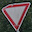
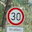
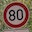
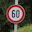

# **Traffic Sign Recognition**

## Writeup

### You can use this file as a template for your writeup if you want to submit it as a markdown file, but feel free to use some other method and submit a pdf if you prefer.

---

**Build a Traffic Sign Recognition Project**

The goals / steps of this project are the following:
* Load the data set (see below for links to the project data set)
* Explore, summarize and visualize the data set
* Design, train and test a model architecture
* Use the model to make predictions on new images
* Analyze the softmax probabilities of the new images
* Summarize the results with a written report

[//]: # (Image References)

[image1]: ./output_imgs/dataset_distribution.jpg "Visualization"
[image2]: ./output_imgs/train_viz.jpg "Visualization"
[image3]: ./output_imgs/valid_viz.jpg "Visualization"
[image4]: ./output_imgs/test_viz.jpg "Visualization"
[image5]: ./output_imgs/dataset_grayscale_conversion.jpg "Original and grayscale images"
<!-- [image6]: ./img_web/stop_2.jpg "Traffic Sign 1"
[image7]: ./img_web/stop_3.jpg "Traffic Sign 2"
[image8]: ./img_web/v30_1.jpg "Traffic Sign 3"
[image9]: ./img_web/v60_1.jpg "Traffic Sign 4"
[image10]: ./img_web/v80_1.jpg "Traffic Sign 5"
[image11]: ./img_web/vorfahrt_1.jpg "Traffic Sign 6" -->
[image12]: ./output_imgs/own_images_from_internet.jpg "Web images"
[image13]: ./output_imgs/own_images_from_internet_detected.jpg "Top 5 Probability"

## Rubric Points
### Here I will consider the [rubric points](https://review.udacity.com/#!/rubrics/481/view) individually and describe how I addressed each point in my implementation.  

---
### Writeup / README

#### 1. Provide a Writeup / README that includes all the rubric points and how you addressed each one. You can submit your writeup as markdown or pdf. You can use this template as a guide for writing the report. The submission includes the project code.

### Data Set Summary & Exploration

#### 1. Provide a basic summary of the data set. In the code, the analysis should be done using python, numpy and/or pandas methods rather than hardcoding results manually.

I used the pandas library to calculate summary statistics of the traffic
signs data set:

* The size of training set is 34799
* The size of the validation set is 4410
* The size of test set is 12630
* The shape of a traffic sign image is 32x32x3
* The number of unique classes/labels in the data set is 43

#### 2. Include an exploratory visualization of the dataset.

Here is an exploratory visualization of the data set. It is a distribution of the classes(labels) of traffic signs in the training, validation and testing dataset. We observed some traffic signs are represented more often than others which could lead to poor accuracy of our deep learning algorithm.

![alt text][image1]

##### Visualization of training, validation and testing datasets:

![alt text][image2]
![alt text][image3]
![alt text][image4]

### Design and Test a Model Architecture

#### 1. Describe how you preprocessed the image data. What techniques were chosen and why did you choose these techniques? Consider including images showing the output of each preprocessing technique. Pre-processing refers to techniques such as converting to grayscale, normalization, etc. (OPTIONAL: As described in the "Stand Out Suggestions" part of the rubric, if you generated additional data for training, describe why you decided to generate additional data, how you generated the data, and provide example images of the additional data. Then describe the characteristics of the augmented training set like number of images in the set, number of images for each class, etc.)

As a first step, I decided to convert the images to grayscale to improve computation speed. As a last step, I normalized the image data to a range of -1 to 1.
Here is an example of a traffic sign image before and after grayscaling:

![alt text][image5]

#### 2. Describe what your final model architecture looks like including model type, layers, layer sizes, connectivity, etc.) Consider including a diagram and/or table describing the final model.

My final model consisted of the following layers:

| Layer         		    |     Description	        					            |
|:---------------------:|:---------------------------------------------:|
| Input         		    |   32x32x1 RGB image   							          |
|Convolution 5x5,layer 1|   1x1 stride, valid padding, outputs 28x28x6	|
| RELU					        |												                        |
| Max pooling 2x2      	|   2x2 stride, outputs 14x14x6				          |
| Convolution 5x5,layer2|   1x1 stride, valid padding, outputs 10x10x16 |
| RELU	                |       									                      |
| Max pooling 2x2			  |   2x2 stride, outputs 5x5x16     							|
|	Flatten		            |		Output 400							                    |
|	Fully connected,layer3|		400x512										                  |
| RELU & Dropout      	|   Keep probability 0.5			                  |
| Fully connected,layer4|   512x512			                                |
| RELU & Dropout			  |	  Keep probability 0.5									      |
| Fully connected,layer5|   512x43, 43 logits			                      |

#### 3. Describe how you trained your model. The discussion can include the type of optimizer, the batch size, number of epochs and any hyperparameters such as learning rate.

I used these optimal parameters below to train our model :
 - Adam optimizer
 - Batch size = 128
 - Epoch = 30
 - learning rate = 0.001

#### 4. Describe the approach taken for finding a solution and getting the validation set accuracy to be at least 0.93. Include in the discussion the results on the training, validation and test sets and where in the code these were calculated. Your approach may have been an iterative process, in which case, outline the steps you took to get to the final solution and why you chose those steps. Perhaps your solution involved an already well known implementation or architecture. In this case, discuss why you think the architecture is suitable for the current problem.

My final model results were:
* training set accuracy of 99.9%
* validation set accuracy of 96.5%
* test set accuracy of 94.6%

The first architecture used was the Vanilla Lenet model which comprises of few layers and does not account for overfitting resulting to low accuracy. By making the network deeper and applying dropout to the architecture, this significantly improved the accuracy of the model.

### Test a Model on New Images

#### 1. Choose five German traffic signs found on the web and provide them in the report. For each image, discuss what quality or qualities might be difficult to classify.

<!-- [image6]: ./img_web/stop_2.jpg "Traffic Sign 1"
[image7]: ./img_web/stop_3.jpg "Traffic Sign 2"
[image8]: ./img_web/v30_1.jpg "Traffic Sign 3"
[image9]: ./img_web/v60_1.jpg "Traffic Sign 4"
[image10]: ./img_web/v80_1.jpg "Traffic Sign 5"
[image11]: ./img_web/vorfahrt_1.jpg "Traffic Sign 6" -->
Original images got from the web:

  

  
<!-- ![alt text][image6]![alt text][image7]![alt text][image8]![alt text][image9]
![alt text][image10]![alt text][image11] -->

Here are six German traffic signs that I found on the web which are augmented to be utilized by the neural network model:

![alt text][image12]

The stop signs might be difficult to classify based on their tilted position and texts inscribed on the sign. Also, two of the speed limit and only yield sign contain additional signs placed below them.

#### 2. Discuss the model's predictions on these new traffic signs and compare the results to predicting on the test set. At a minimum, discuss what the predictions were, the accuracy on these new predictions, and compare the accuracy to the accuracy on the test set (OPTIONAL: Discuss the results in more detail as described in the "Stand Out Suggestions" part of the rubric).

<!-- Here are the results of the prediction:

| Image			        |     Prediction	        					|
|:---------------------:|:---------------------------------------------:|
| Stop Sign      		| Stop sign   									|
| U-turn     			| U-turn 										|
| Yield					| Yield											|
| 100 km/h	      		| Bumpy Road					 				|
| Slippery Road			| Slippery Road      							| -->

The model was able to correctly guess 4 of the 6 traffic signs which gave an accuracy of 66.7%. Training the model with more augmented versions of the total images including the two signs incorrectly predicted will improve it's accuracy.  

#### 3. Describe how certain the model is when predicting on each of the five new images by looking at the softmax probabilities for each prediction. Provide the top 5 softmax probabilities for each image along with the sign type of each probability. (OPTIONAL: as described in the "Stand Out Suggestions" part of the rubric, visualizations can also be provided such as bar charts)

Visualizing the top 5 predictions, I observed that only the second stop sign image wrongly predicted the probability of the stop sign.
The code for making the top 5 k predictions is located on the second to last code cell of the Ipython notebook.

![alt text][image13]
<!--
For the first image, the model is relatively sure that this is a stop sign (probability of 0.6), and the image does contain a stop sign. The top five soft max probabilities were

| Probability         	|     Prediction	        					|
|:---------------------:|:---------------------------------------------:|
| .60         			| Stop sign   									|
| .20     				| U-turn 										|
| .05					| Yield											|
| .04	      			| Bumpy Road					 				|
| .01				    | Slippery Road      							| -->

<!-- For the second image ... -->

#### 4. Possible Improvements:

* Training the data with images augmented in other different ways that are not currently implemented. This will account for more variability in datasets seen by our model.

* Uploading more image data of labels with few sample images to improve overall model accuracy
